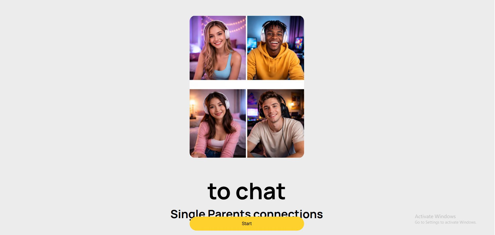
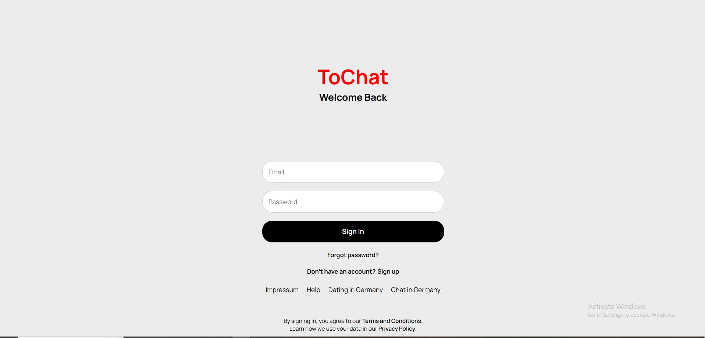
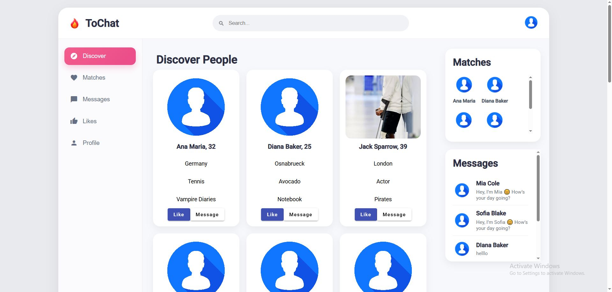
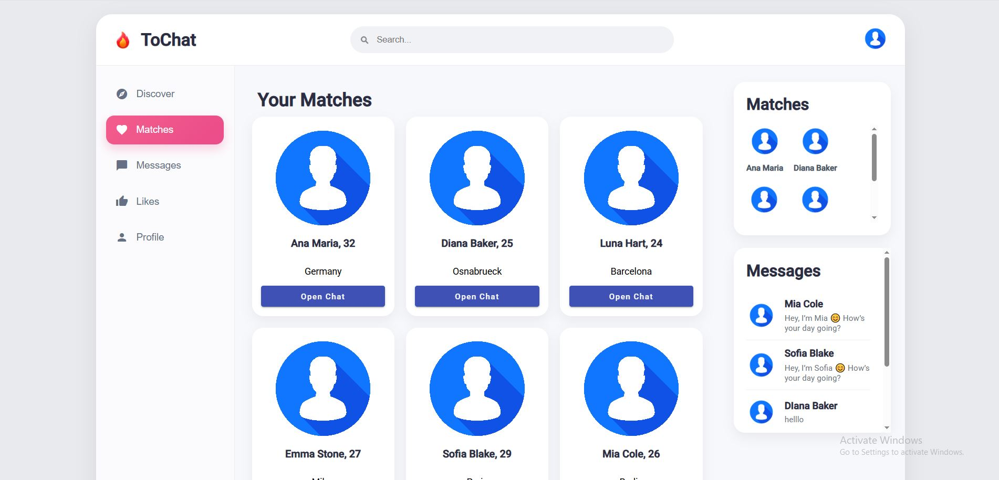
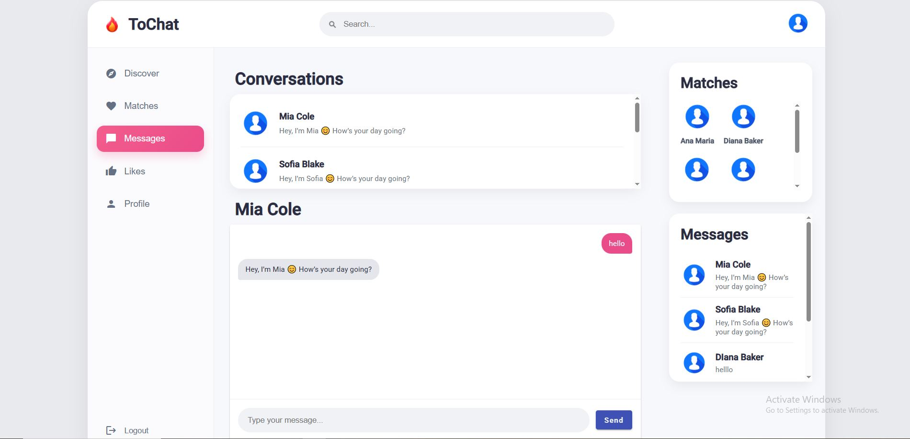
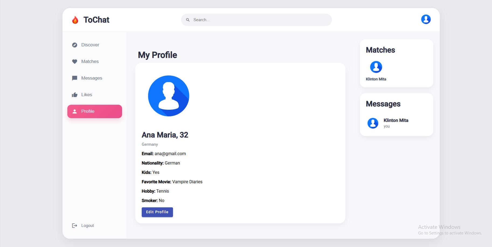

# toChat — Real-Time Dating Chat App

Angular dating chat application with authentication, user discovery, matching, and real-time messaging.

## 🚀 Tech Stack

- Angular 17
- TypeScript
- Firebase
- AngularFire
- RxJS
- SCSS

## ✨ Features

- Sign up and login
- Discover users
- Like users
- Match with users
- Real-time chat
- Responsive design

## 📷 Screenshots

### Main


### Sign In


### Discover


### Matches


### Messages


### Profile


## ⚙️ Installation

```bash
npm install
ng serve
